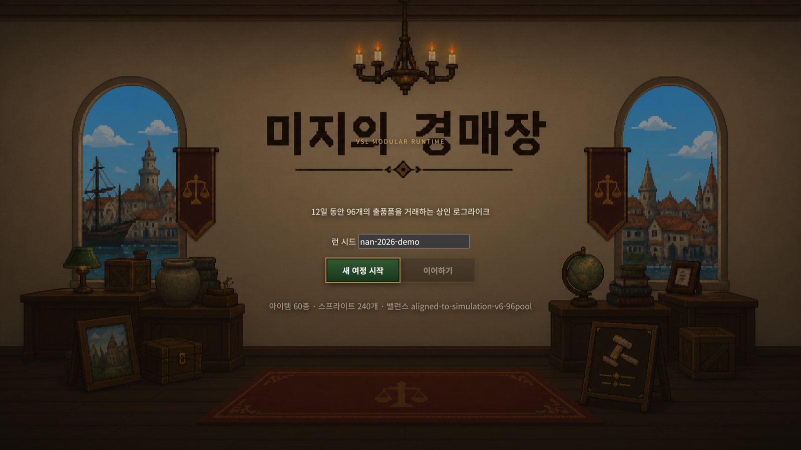
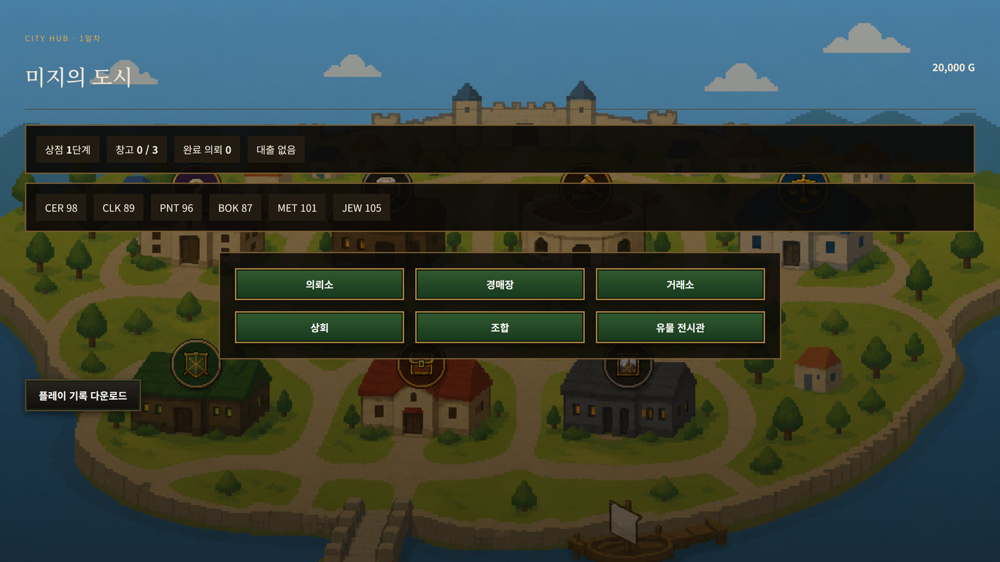
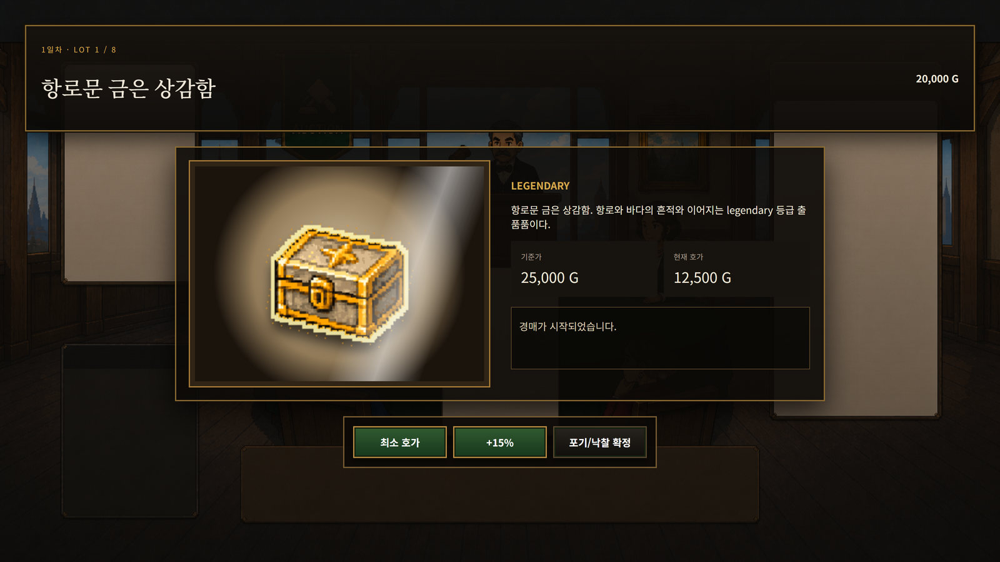
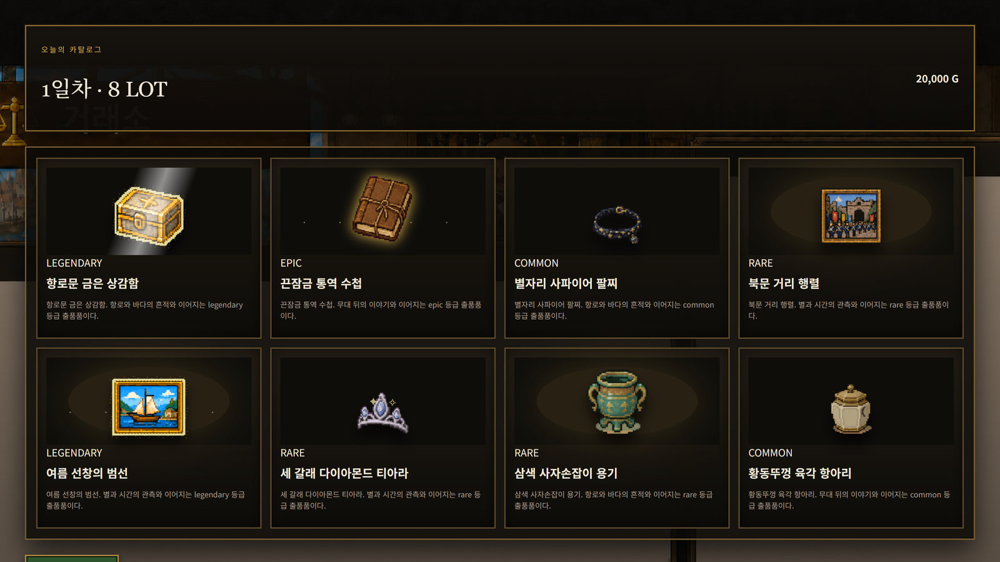

# 미지의 경매장 — 게임 소개 및 설명

> 12일 동안 경매품의 숨은 연결을 읽고, 입찰·판매·의뢰로 상회를 키워 최종 유물 경매에 도전하는 추론 경매 시뮬레이션

## 1. 게임 개요



### 제목

미지의 경매장

### 한 줄 소개

12일 동안 경매품의 숨은 연결을 읽고, 입찰·판매·의뢰로 상회를 키워 최종 유물
경매에 도전하는 추론 경매 시뮬레이션.

### 핵심 경험

**기준가는 모두에게 보이지만 진짜 가치는 보이지 않는다.** 플레이어는 물건의
설명·소문·세트 힌트·시장 흐름·경쟁자의 행동을 겹쳐 읽고 값을 추론한다. 같은
물건이라도 언제 사고 어디에 팔며 어떤 세트를 노리는지에 따라 결과가 달라진다.

| | |
|---|---|
| 장르 | 싱글플레이 추론 경매 · 상회 육성 |
| 분량 | **12일 × 하루 8개 LOT = 96개 LOT**, 13일차에 최종 유물 경매 |
| 시작 자금 | 20,000 G |
| 품목 | 6개 계열 60종, 등급 4단계(일반·희귀·영웅·전설) |
| 플레이 시간 | 한 판 약 10분 |

## 2. 플레이 방법

### 목표

제한된 자금과 보관칸을 굴려 저평가된 물건을 확보하고, 시장 수요와 의뢰 조건에
맞춰 더 높은 값에 판다. **12일 동안 파산하지 않고 상회를 키운 뒤 13일차 최종
유물 경매에 도전한다.**



### 도시의 일곱 장소

| 장소 | 하는 일 |
|---|---|
| 경매장 | 오늘의 8개 LOT을 확인하고 입찰한다 |
| 거래소 | 보유품을 시장 시세로 판다 |
| 의뢰소 | 조건에 맞는 물건을 납품해 보상을 받는다 |
| 술집 | 정보상에게 시세와 소식을 듣는다. **무료이며 상회 단계가 오르면 공개 범위가 넓어진다** |
| 상회 | 상점을 확장해 보관칸과 거래 조건을 개선한다 |
| 조합 | 미판매 물품을 담보로 단기 자금을 빌린다 |
| 유물 전시관 | 모은 세트와 유물 효과를 확인한다 |

### 하루의 흐름

1. 도시에서 오늘의 시장과 의뢰를 확인한다.
2. 경매장에서 8개 물건의 이름·설명·소문·세트 힌트를 비교한다.
3. 경매를 시작하고 경쟁자와 호가를 겨룬다.
4. 낙찰품을 보관칸에 넣고, 팔 것과 쥐고 갈 것을 나눈다.
5. 거래소·의뢰소에서 처분하고 대출을 정리한다.
6. 하루를 결산하고 다음 날로 넘어간다.
7. 12일이 끝나면 최종 유물 경매에 들어간다.

### 경매는 시간이 붙는 구조다

경매는 **15초**로 시작하고 **입찰이 들어올 때마다 3초가 붙는다.** 남은 시간이
0이 되면 마지막 입찰자가 가져간다. 호가는 `+5%` · `+10%` · `+20%` 버튼이나
직접 입력으로 올리고, 물러설 때는 패스한다.

경쟁자는 각자 예산과 관심 계열이 다르다. **어떤 물건에 누가 달려드는지가
그 물건의 값에 대한 단서**가 된다.

### 주요 판단

- 기준가보다 실제 가치가 높을 가능성이 있는가?
- 지금 팔 것인가, 세트나 의뢰를 위해 쥐고 갈 것인가?
- 경쟁자가 올리는 값을 감수하고 계속 붙을 것인가?
- 보관칸이 모자란데 무엇을 버릴 것인가?
- 후반 기회를 위해 자금을 남길 것인가, 지금 담보로 당길 것인가?

### 종료 조건

- **파산** — 대출 상환에 실패하거나 자금이 무너지면 그 자리에서 끝난다
- **완주** — 12일을 넘기면 13일차 최종 유물 경매에 진입하고, 그 결과로 런이 마무리된다

## 3. 게임의 차별점

### 3.1 값이 아니라 관계를 읽는 경매

물건의 실제 가치는 엔진이 정하지만 플레이어에게 다 보여주지 않는다. **설명에
적힌 흔적, 소문, 세트 힌트, 경쟁자의 반응을 겹쳐야 이번 런의 논리가 보인다.**



세트는 12개가 있고, 각 세트에는 **과거에 있었던 하나의 사건**이 붙는다. 그
사건이 어떤 물건 둘을 엮는지가 세트를 알아보는 단서다. 세트를 모으면 유물
전시관에서 효과가 열린다.

### 3.2 같은 규칙, 달라지는 이야기

게임 규칙과 밸런스 수치는 고정된 엔진이 관리한다. **생성 AI는 그 위에서 표현만
채운다** — 품목 이름과 설명, 소문, 세트 힌트, 세트 사건과 신문 리드, 시장
헤드라인이다. 가격·보상·확률은 생성하지 않는다.

그래서 밸런스는 런마다 같고 **읽을거리는 런마다 다르다.** 같은 물건이 다른
런에서 다른 설명과 다른 세트 힌트를 받는다.



기술적인 내용은 `02-AI활용기술` 문서에 있다.

### 3.3 생성이 실패해도 게임은 멈추지 않는다

생성 결과는 플레이보다 앞서 준비된다. **저장 슬롯을 고르는 동안 12일 구성이
만들어지고**, 진행 중에는 2일 뒤까지 미리 채운다.

계약을 통과하지 못한 항목은 그 항목만 다시 만들고, 공급자가 응답하지 않으면
다음 공급자로 넘어가며, 그래도 안 되면 미리 준비해 둔 문구로 채운다. **어느
경우에도 12일 진행은 끊기지 않는다.**

## 4. 실행 방법 및 조작

### 웹 플레이

- 플레이 URL: ________________________________
- 권장 환경: 데스크톱 Chrome 또는 Edge 최신 버전, 1600×900 이상
- 설치와 로그인이 필요 없다. 링크를 열면 바로 시작한다.

### 시작 순서

1. 링크를 연다.
2. **새 게임**을 고른다. 이때 12일 구성 생성이 뒤에서 시작된다.
3. 저장 슬롯 세 칸 중 하나를 고른다. 슬롯마다 런 시드가 따로 기록된다.
4. **새 여정 시작**을 누르면 도시로 들어간다.

이어서 하려면 타이틀에서 **이어하기**를 고른다. 저장은 슬롯별로 자동 기록된다.

### 기본 조작

- **마우스 클릭만으로 진행한다.** 장소 이동, 물건 선택, 입찰, 판매, 결산이 모두 클릭이다.
- 키보드는 런 시드나 직접 입찰가를 넣을 때만 쓴다.
- 화면 오른쪽 위 톱니바퀴에서 소리를 끄거나 타이틀로 돌아갈 수 있다.

### 로컬 실행

저장소를 받아 정적 서버로 열어도 된다.

```bash
cd Runtime
npx serve .          # 또는 임의의 정적 서버
# 브라우저에서 index.html 을 연다
```

### 관련 링크

- 전체 소스: https://github.com/sangjin615/NAN_2026_Team_Project
- 실제 플레이 영상: ________________________________
- 문의: ________________________________
